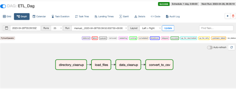

## Airflow Setup and Instructions

🖥️  <a href="http://23.21.117.161:8080/home" target="_blank">Airflow Public Instance</a>


### Branch Structure

* [airflow/dags](./airflow/dags)
  * [data_cleanup.py](./airflow/dags/data_cleanup.py)
  * [dataextraction.py](./airflow/dags/dataextraction.py)
  * [extraction_dag.py](./airflow/dags/extraction_dag.py)
* [Dockerfile](./Dockerfile)
* [docker-compose.yaml](./docker-compose.yaml)
* [requirements.txt](./requirements.txt)
* [README.md](./README.md)

### Pre-requisites

1. Code Editor (PyCharm, VS Code, etc)
2. Docker
3. Python v3.2 or later

### Steps on run Airflow locally

1. Clone the airflow branch using the following code on terminal - 
````
git clone --branch airflow https://github.com/BigDataIA-Spring2023-Team-11/PulseVision.git
````
2. Move to the project directory and run the following command in terminal to create a .env file
````
nano .env
````
3. Add the following environment variables with values:
```
AIRFLOW_UID=501
AIRFLOW_PROJ_DIR=./airflow
ACCESS_KEY=
SECRET_KEY=
SOURCE_BUCKET=
API_KEY=
KMP_DUPLICATE_LIB_OK=TRUE
```
4. In docker-compose.yaml, update airflow login credentials on line 264 and 265
```commandline
      _AIRFLOW_WWW_USER_USERNAME: ${_AIRFLOW_WWW_USER_USERNAME:-}
      _AIRFLOW_WWW_USER_PASSWORD: ${_AIRFLOW_WWW_USER_PASSWORD:-}
```
5. Save file while exiting the editor -> *control* + *x*
6. Install requirements using command - 
```commandline
pip install -r requirements.txt
```
7. Ensure docker is running in background. Run following commands - 
```commandline
docker-compose build
docker compose up airflow-init
docker compose up
```
8. Once the localhost URL is shared, go to : https://localhost:8080/
9. Login using credentials set up step 4
10. Review DAG: ETL_dag
11. Go to dags to trigger run, view logs, graphs etc.


The ‘ETL_dag’ with dependencies – 




